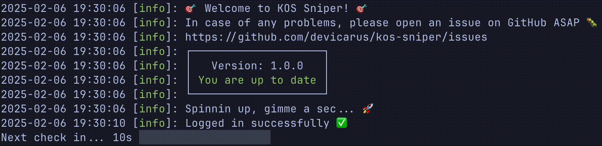

<div align="center">

### 🎯 Welcome to KOS Sniper! 🎯

> Automatically sign up for parallels when a spot opens up!



<br>

<p align="center">

<a href="https://github.com/devicarus/kos-sniper/issues/new"></a>

</p>

</div>

---

## Instalation

> Requires [Node.js ](https://nodejs.org/) v22.13.1 or higher to run.

```sh
# Clone the repository
git pull https://github.com/devicarus/kos-sniper
# Install the dependencies  
cd kos-sniper && npm install 
# Copy the example configuration
cp .env.example .env
```

## Configuration

All the configuration is done in the `.env` file, there are the following properties:

| Property                  | Description                                                  | Default |
| ------------------------- | ------------------------------------------------------------ | ------- |
| `KOS_USERNAME` (required) | Your KOS username                                            |         |
| `KOS_PASSWORD` (required) | Your KOS password                                            |         |
| `SECONDS_BETWEEN_CHECKS`  | Time between schedule checks in seconds                      | `180`   |
| `SECONDS_BEFORE_RESTART`  | Time before the program restarts after an error in seconds   | `1200`  |
| `SECONDS_TIMEOUT`         | Time to wait for KOS to respond before timing out in seconds | `30`    |

## Usage

```sh
npm start # That's it, now sit back and relax!
```

## Known Issues

> ⚠️ For obvious reasons the program is being worked on only during the schedule creation period ⚠️

- `puppeteer` sometimes throws `net::ERR_CONNECTION_TIMED_OUT` instead of the usual `TimeoutError` which results in the Sniper throwing a generic error, rather than the specific one. Doesn't affect the functionality of the app.